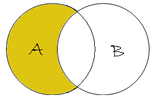
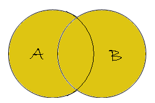

# JOIN

## INNER JOIN


```sql
SELECT *
  FROM a
 INNER JOIN b ON a.key = b.key;
```

## LEFT OUTER JOIN or LEFT JOIN


```sql
SELECT *
  FROM a
  LEFT OUTER JOIN b ON a.key = b.key;
```



```sql
SELECT *
  FROM a
  LEFT OUTER JOIN b ON a.key = b.key
 WHERE b.key IS NULL;
```

## RIGHT OUTER JOIN or RIGHT JOIN


```sql
SELECT *
  FROM a
 RIGHT OUTER JOIN b ON a.key = b.key;
```


```sql
SELECT *
  FROM a
 RIGHT OUTER JOIN b ON a.key = b.key
 WHERE a.key IS NULL;
```

## FULL OUTER JOIN or FULL JOIN



```sql
SELECT *
  FROM a
  FULL OUTER JOIN b ON a.key = b.key;
```


```sql
SELECT *
  FROM a
  FULL OUTER JOIN b ON a.key = b.key
 WHERE a.key IS NULL
   AND b.key IS NULL;
```
