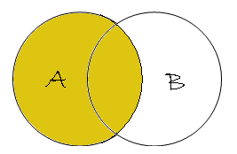
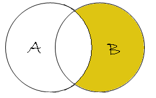

# SQL Concepts

This repo is a set of SQL documents and examples.

## Tables

The tables used in the examples:

Table **employees**

| FirsName  | DepartmentId |
|-----------|:------------:|
| Rafael    | 31           |
| Juan      | 33           |
| Hernando  | 33           |
| Roberto   | 34           |
| Pedro     | 34           |
| Guillermo | `NULL`       |

Table **departments**

| DepartmentId | DepartmentName |
|:------------:|----------------|
| 31           | Ventas         |
| 33           | Ingeniería     |
| 34           | Contabilidad   |
| 35           | Marketing      |

### SQL Statements

See [tables.sql](./tables.sql)

```sql
--
-- DDL
--
CREATE TABLE department
(
    DepartmentID   INT         Primary key,
    DepartmentName VARCHAR(20)
);


CREATE TABLE employees
(
    FistName     VARCHAR(20),
    DepartmentID INT         references departments(DepartmentID)
);

--
-- DML
--
INSERT INTO departments (DepartmentID, DepartmentName) VALUES (31, 'Ventas');
INSERT INTO departments (DepartmentID, DepartmentName) VALUES (33, 'Ingeniería');
INSERT INTO departments (DepartmentID, DepartmentName) VALUES (34, 'Contabilidad');
INSERT INTO departments (DepartmentID, DepartmentName) VALUES (35, 'Marketing');

INSERT INTO employees (FirstName, DepartmentID) VALUES ('Rafael', 31);
INSERT INTO employees (FirstName, DepartmentID) VALUES ('Juan', 33);
INSERT INTO employees (FirstName, DepartmentID) VALUES ('Hernando', 33);
INSERT INTO employees (FirstName, DepartmentID) VALUES ('Roberto', 34);
INSERT INTO employees (FirstName, DepartmentID) VALUES ('Pedro', 34);
INSERT INTO employees (FirstName, DepartmentID) VALUES ('Guillermo', NULL);
```

## JOINs

### INNER JOIN


```sql
SELECT employees.FirstName, employees.DepartmentID, departments.DepartmentName
  FROM employees
 INNER JOIN departments ON employees.DepartmentID = departments.DepartmentID;

FirstName   DepartmentID  DepartmentName
----------  ------------  --------------
Robinson    34            Clerical
Jones       33            Engineering
Smith       34            Clerical
Heisenberg  33            Engineering
Rafferty    31            Sales
```

### LEFT OUTER JOIN or LEFT JOIN



```sql
SELECT *
  FROM employees
  LEFT OUTER JOIN departments ON employees.DepartmentID = departments.DepartmentID;

employees.FirstName  employeee.DepartmentID  departments.DepartmentName  departmentd.DepartmentID
-------------------  ----------------------  --------------------------  ------------------------
Jones                33                      Engineering                 33
Rafferty             31                      Sales                       31
Robinson             34                      Clerical                    34
Smith                34                      Clerical                    34
Williams             NULL                    NULL                        NULL
Heisenberg           33                      Engineering                 33
```


```sql
SELECT *
  FROM employees
  LEFT OUTER JOIN departments ON employees.DepartmentID = departments.DepartmentID
 WHERE departments.DepartmentID IS NULL;
```

### RIGHT OUTER JOIN or RIGHT JOIN


```sql
SELECT *
  FROM employees
 RIGHT OUTER JOIN departments ON employees.DepartmentID = departments.DepartmentID;

employees.FirstName  employeee.DepartmentID  departments.DepartmentName  departmentd.DepartmentID
-------------------  ----------------------  --------------------------  ------------------------
Smith                34                      Clerical                    34
Jones                33                      Engineering                 33
Robinson             34                      Clerical                    34
Heisenberg           33                      Engineering                 33
Rafferty             31                      Sales                       31
NULL                 NULL                    Marketing                   35
```



```sql
SELECT *
  FROM employees
 RIGHT OUTER JOIN departments ON employees.DepartmentID = departments.DepartmentID
 WHERE employees.DepartmentID IS NULL;
```

### FULL OUTER JOIN or FULL JOIN

```sql
SELECT *
  FROM employees
  FULL OUTER JOIN departments ON employee.DepartmentID = department.DepartmentID;

employees.FirstName  employeee.DepartmentID  departments.DepartmentName  departmentd.DepartmentID
-------------------  ----------------------  --------------------------  ------------------------
Smith                34                      Clerical                    34
Jones                33                      Engineering                 33
Robinson             34                      Clerical                    34
Williams             NULL                    NULL                        NULL
Heisenberg           33                      Engineering                 33
Rafferty             31                      Sales                       31
NULL                 NULL                    Marketing                   35
```

```sql
SELECT *
  FROM employees
  FULL OUTER JOIN departments ON employee.DepartmentID = department.DepartmentID
 WHERE employees.DepartmentID IS NULL
   AND departments.DepartmentID IS NULL;
```
